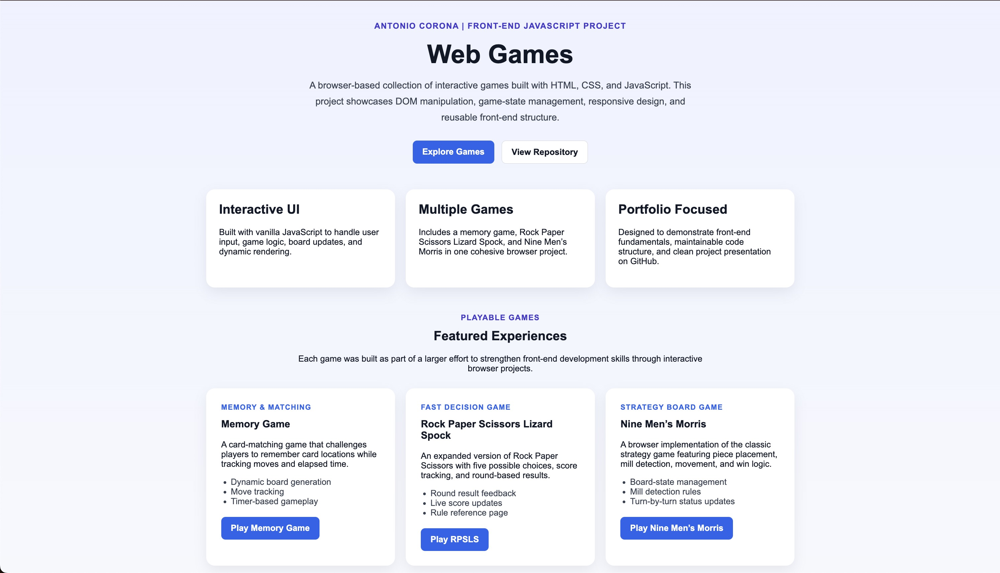
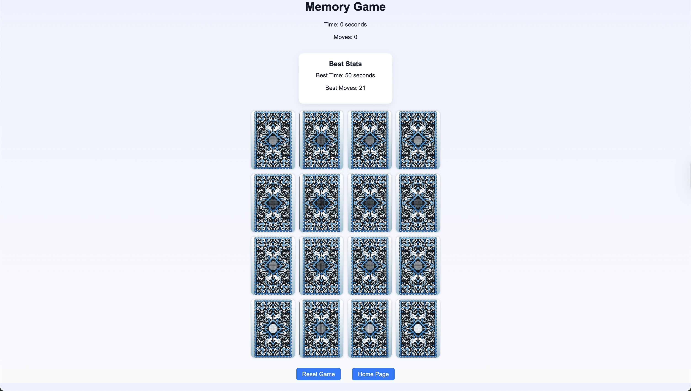
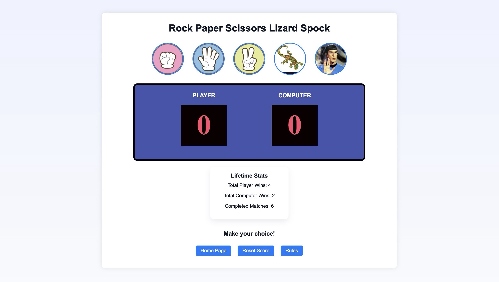
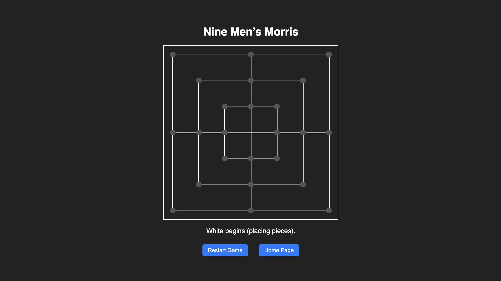

# Web Games

A browser-based collection of interactive games built with **HTML, CSS, and JavaScript**.  
This project was created to strengthen front-end development skills through game logic, DOM manipulation, UI design, and browser-side state management.

## Live Demo

Play the project here:  
**https://antonioc-26.github.io/Web-Games/**

---

## Screenshots

### Home Page


### Memory Game


### Rock Paper Scissors Lizard Spock


### Nine Men’s Morris


---

## Project Overview

Web Games is a front-end portfolio project that combines multiple browser-playable experiences into one cohesive site. The project focuses on:

- interactive JavaScript-based gameplay
- responsive page structure and styling
- dynamic DOM updates
- reusable front-end organization
- persistent browser storage for player statistics

This repository is intended to demonstrate both technical fundamentals and project presentation quality for internships and entry-level software roles.

---

## Games Included

### 1. Memory Game
A classic card-matching game where the player flips cards to find matching pairs.

**Highlights**
**Highlights**
- dynamically generated card board
- move counter
- live timer
- persistent best-score tracking with `localStorage`
- animated card flip transitions
- in-page win modal with new game flow

### 2. Rock Paper Scissors Lizard Spock
An expanded version of Rock Paper Scissors with five move options and round-based scoring.

**Highlights**
- computer opponent with randomized choice generation
- live score updates
- persistent lifetime match statistics with `localStorage`
- dedicated rules page

### 3. Nine Men’s Morris
A browser implementation of the classic strategy board game.

**Highlights**
- piece placement phase
- movement phase
- mill detection
- turn-based status messaging
- restart support

---

## Tech Stack

- **HTML5**
- **CSS3**
- **Vanilla JavaScript**
- **localStorage**
- **Node.js / serve** for optional local hosting

---

## What This Project Demonstrates

This project was built to showcase practical front-end skills, including:

- DOM manipulation
- event-driven JavaScript
- game-state management
- browser storage
- responsive layout structure
- maintainable project organization
- user-focused UI improvements

---

## First Time Setup

Follow these steps to run the project locally.

### 1. Clone the Repository
    git clone https://github.com/antonioc-26/web-games.git 
    cd web-games

Or download the ZIP from GitHub and extract it.

--- 

### 2. Open the Project in VS Code

Open **Visual Studio Code** and select:

File → Open Folder → web-games

## Running the Project (Recommended)
### Using VS Code Live Server

This is the easiest way to run the project locally.

### Step 1: Install the Live Server Extension

1. Open **VS Code**
2. Click the **Extensions** icon
3. Search for: "Live Server"

4. Install **Live Server (by Ritwick Dey)**

---

### Step 2: Start the Server

Right click the file:

    index.html

Select:
    
    Open With Live Server

Your browser will automatically open something similar to:

    http://127.0.0.1:5500/index.html

---

### Live Reload

When you edit and save any file such as:

    CSS
    JavaScript
    HTML

The browser will automatically refresh.

---

## Project Structure
```
web-games/
├── README.md
├── assets
│   ├── css
│   │   └── style.css
│   ├── images
│   │   ├── screenshots
│   │   │   ├── landing-page-preview.png
│   │   │   ├── memory-preview.png
│   │   │   ├── morris-preview.png
│   │   │   └── rpsls-preview.png
│   │   ├── memory
│   │   │   ├── Card1.jpg
│   │   │   ├── Card2.jpg
│   │   │   ├── backofcard.jpg
│   │   │   ├── card3.jpg
│   │   │   ├── card4.jpeg
│   │   │   ├── card5.jpeg
│   │   │   ├── card6.jpg
│   │   │   ├── card7.jpg
│   │   │   └── card8.jpg
│   │   └── rpsls
│   │       ├── lizard.webp
│   │       ├── paper.jpg
│   │       ├── rock.jpg
│   │       ├── rpsls-rules.jpg  
│   │       ├── scissors.jpg
│   │       └── spock.jpeg
│   └── js
│       ├── memory.js
│       ├── morris.js
│       └── rpsls.js
├── index.html
├── package.json
└── pages
    ├── memory.html
    ├── nine-mens-morris.html
    ├── rock-paper-scissors-lizard-spock.html
    └── rpsls-rules.html  
```

---

## Development

If you plan to modify or add games:

1. Run the project using Live Server
2. Edit HTML/CSS/JavaScript files
3. Test changes in the browser with auto-refresh

---

## Contributing

Contributions are welcome.

If you'd like to improve the project:

1. Fork the repository
2. Create a feature branch
3. Commit your changes
4. Open a pull request

---

## License

This project is open source and available under the **MIT License**.

---

## Author

Developed by: Antonio Corona Montes De Oca  
GitHub: https://github.com/antonioc-26
